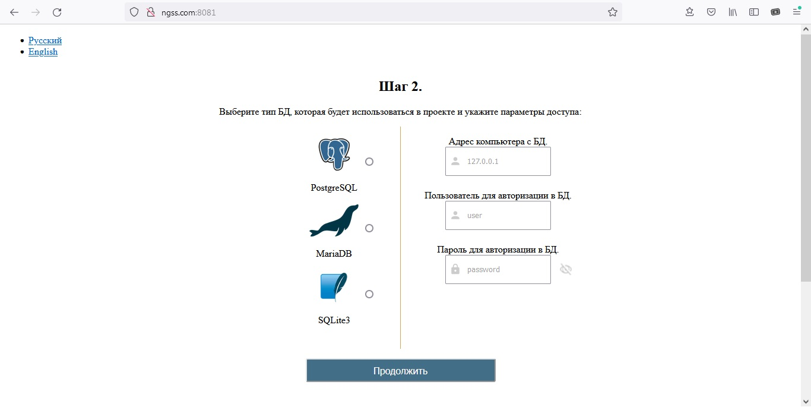
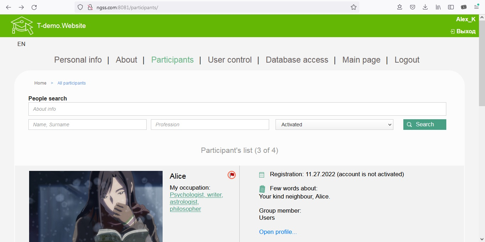
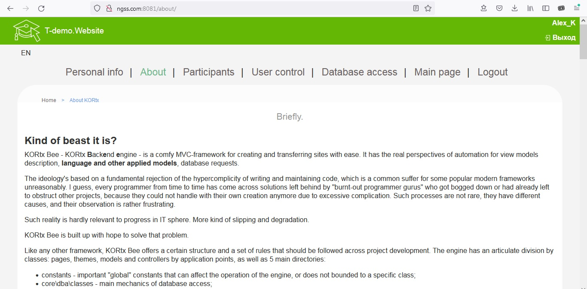

# KORtx Bee
 Comfy framework with PostgreSQL, MariaDB and SQLite3 support out of the box.

You're observing the installer. Simply copy files to the host, load index.php, then go through. Lots of information would become available after the installation is complete.

Minimal requirements are: 
Php 7.2 and ( PostgreSQL 9.5 or MariaDB 10.4 or SQLite 3.9.1 ).
[PHP.ini]
short_open_tag = On; <-- Had been planned to deprecate or even to remove https://wiki.php.net/rfc/deprecate_php_short_tags !!! This is INSANE!
extension=php_curl.dll
extension=php_gd2.dll
extension=php_mbstring.dll
AND
(
	extension=php_mysqli.dll
OR
	extension=php_pgsql.dll
OR
	extension=php_sqlite3.dll
)

KORtx Bee project is free of use (MIT). I will be glad if while using KORtx Bee, you will save a small credits to an author in commentaries.

Also remember, that gratitude feels good, while currency supports good. :)

If you like KORtx Bee so much or it did come handy and saved you a lot of time (nerves), you may provide some support for me (appreciate for anything) with Qiwi: +7(nine-zero-four)6543257

Thanks for visiting and reading. Have a good luck! 

(ALSO: SAVE SHORT OPEN TAGS in Php! Hands away from Shortens!)

Some screenshots:

