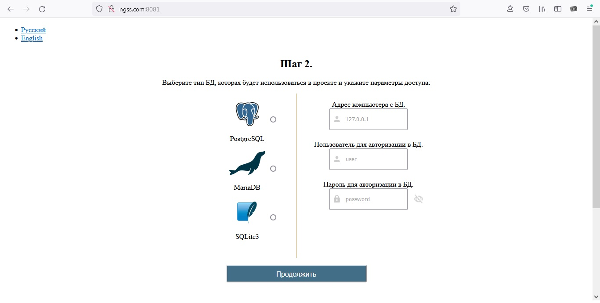
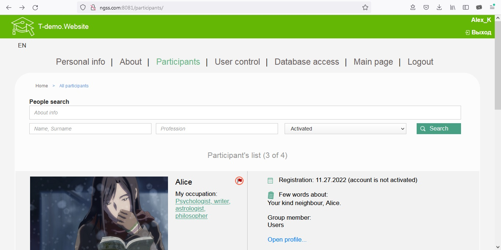
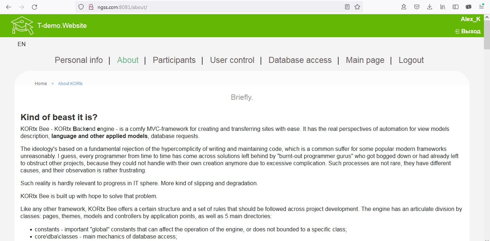

# KORtx Bee
 Comfy framework with PostgreSQL, MariaDB and SQLite3 support out of the box.

You're observing the installer. Simply copy files to the host, load index.php, then go through. Lots of information would become available after the installation is complete.

**Minimal requirements are:**  
+ Php 7.2
+ PostgreSQL 9.5 or MariaDB 10.4 or SQLite 3.9.1
+ Apache 2.2; nginx probably may work, but .htaccess logic needs to be set up in nginx.conf.

**Next settings had to be checked before the install:**  
[PHP.ini]  
short_open_tag = On; <-- Had been planned to deprecate or even to remove https://wiki.php.net/rfc/deprecate_php_short_tags !!! This is INSANE!  
extension=php_curl.dll  
extension=php_mbstring.dll  
AND  
(  
	extension=php_gd.dll  
OR  
	extension=php_gd2.dll  
)  
AND  
(  
	extension=php_mysqli.dll  
OR  
	extension=php_pgsql.dll  
OR  
	extension=php_sqlite3.dll  
)    

[PostgreSQL, MariaDB]  
Check if user with password access (and SUPER privilege on *.* if the database have to be created while the installation) exists.
  
[Apache]  
Check rewrite_module loaded and "AllowOverride all" is setup for the Directory. 
  
KORtx Bee project is free of use (MIT). I will be glad if while using KORtx Bee, you will save a small credits to an author in commentaries.

Thanks for visiting and reading. Have a good luck! 

(ALSO: SAVE SHORT OPEN TAGS in Php! Hands away from Shortens!)

**Some screenshots:**

